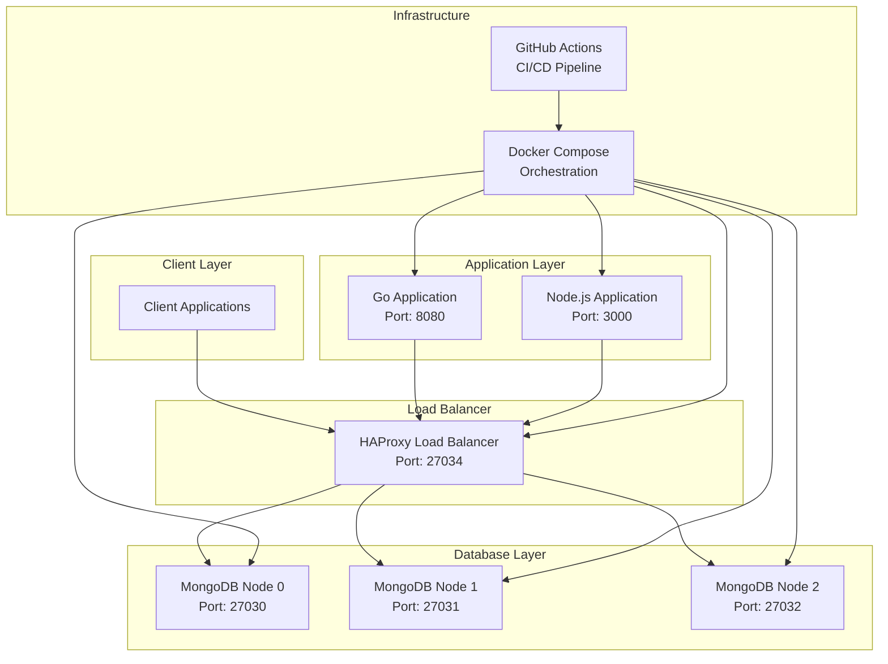
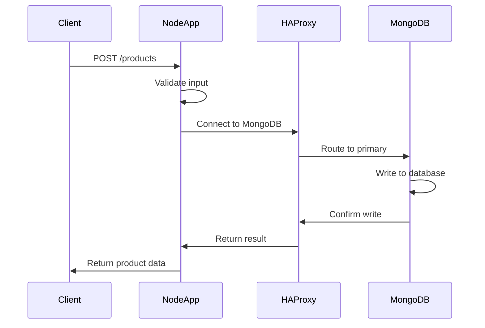
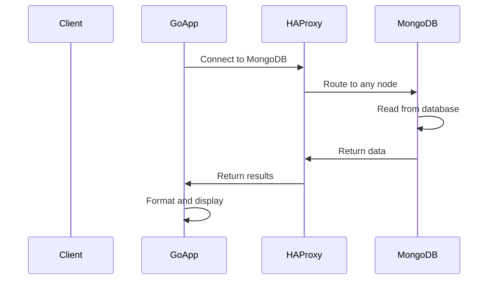
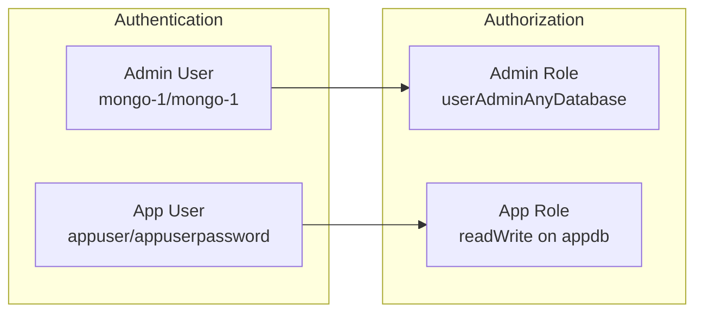
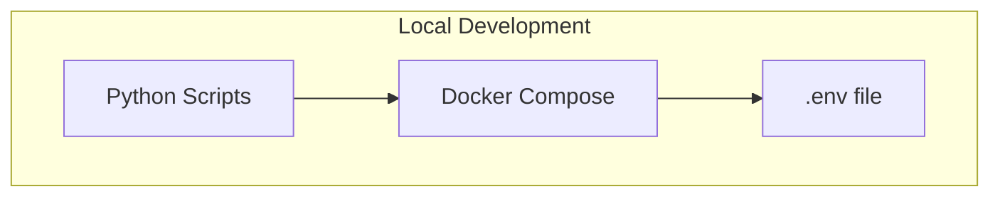
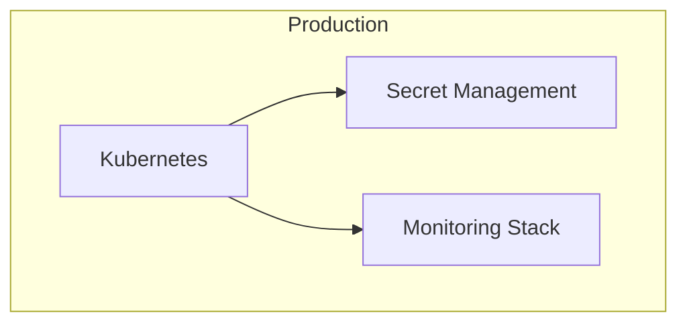
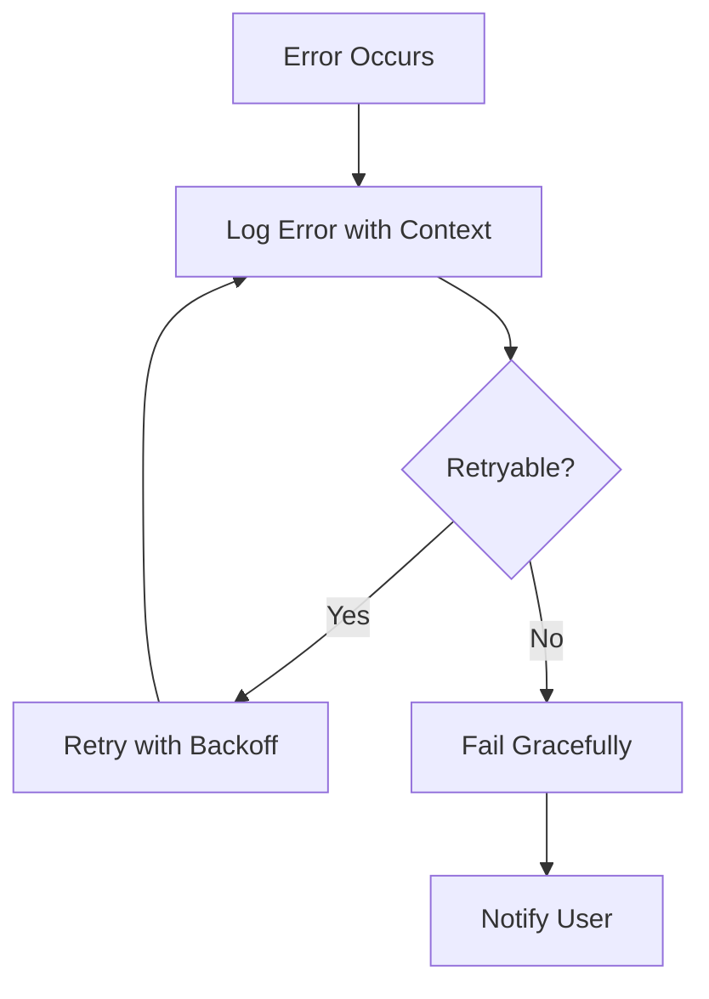

# Architecture Documentation

## System Overview

This project implements a microservices architecture with MongoDB replica set, featuring:
- **MongoDB Replica Set** (3 nodes) for high availability
- **HAProxy** for load balancing
- **Go Application** for reading products
- **Node.js Application** for creating products
- **Docker Compose** for orchestration

## Architecture Diagram



## Component Details

### 1. MongoDB Replica Set

**Purpose**: High availability database cluster
**Components**:
- 3 MongoDB nodes (mongo-0, mongo-1, mongo-2)
- Replica set name: `rs0`
- Authentication enabled with keyfile
- Admin user for management
- Application user for data access

**Configuration**:
```yaml
# Example MongoDB node configuration
mongod --replSet rs0 --bind_ip_all --keyFile /etc/mongo-keyfile
```

### 2. HAProxy Load Balancer

**Purpose**: Distribute database connections across replica set
**Configuration**:
- Port: 27034
- Round-robin load balancing
- Health checks for MongoDB nodes
- Connection pooling

### 3. Go Application

**Purpose**: Read products from database
**Features**:
- Structured logging with zap
- Health check endpoint (/health)
- Environment variable configuration
- Error handling and retry logic

**API Endpoints**:
- `GET /health` - Health check

### 4. Node.js Application

**Purpose**: Create products in database
**Features**:
- Structured logging with winston
- Input validation with express-validator
- Rate limiting with express-rate-limit
- Health check endpoint (/health)
- REST API for product creation

**API Endpoints**:
- `GET /health` - Health check
- `POST /products` - Create product (with validation)

## Data Flow

### Product Creation Flow



### Product Reading Flow



## Security Architecture

### Authentication & Authorization



### Network Security

- **Internal Network**: All services communicate via Docker network
- **Port Exposure**: Only necessary ports exposed to host
- **Authentication**: MongoDB keyfile authentication
- **Environment Variables**: Sensitive data in environment variables

## Deployment Architecture

### Development Environment



### Production Environment



## Monitoring & Observability

### Health Checks

- **MongoDB**: Ping command to verify connectivity
- **HAProxy**: Configuration validation
- **Go App**: HTTP health endpoint
- **Node.js App**: HTTP health endpoint

### Logging

- **Structured Logging**: JSON format with timestamps
- **Log Levels**: DEBUG, INFO, WARN, ERROR
- **Context**: Service name, version, environment
- **Security**: Sensitive data masked in logs

### Metrics

- **Application Metrics**: Request count, response time
- **Database Metrics**: Connection count, query performance
- **Infrastructure Metrics**: CPU, memory, disk usage

## Error Handling

### Application Errors



### Database Errors

- **Connection Errors**: Retry with exponential backoff
- **Authentication Errors**: Log and fail fast
- **Query Errors**: Log details and continue
- **Replica Set Errors**: Switch to healthy nodes

## Performance Considerations

### Database Performance

- **Connection Pooling**: Reuse connections
- **Indexes**: Proper indexing on frequently queried fields
- **Read Preferences**: Read from secondary nodes when possible
- **Write Concerns**: Appropriate write concern levels

### Application Performance

- **Caching**: In-memory caching for frequently accessed data
- **Rate Limiting**: Prevent abuse and ensure fair usage
- **Async Operations**: Non-blocking I/O operations
- **Resource Limits**: Docker resource constraints

## Scalability

### Horizontal Scaling

- **MongoDB**: Add more replica set members
- **Applications**: Scale application instances
- **Load Balancer**: Add more HAProxy instances

### Vertical Scaling

- **Resource Allocation**: Increase CPU/memory limits
- **Database Optimization**: Tune MongoDB parameters
- **Application Optimization**: Profile and optimize code

## Disaster Recovery

### Backup Strategy

- **MongoDB**: Regular backups with mongodump
- **Configuration**: Version control for all configs
- **Data**: Point-in-time recovery capabilities

### Recovery Procedures

1. **Database Recovery**: Restore from backup
2. **Application Recovery**: Redeploy from container images
3. **Configuration Recovery**: Restore from version control
4. **Data Validation**: Verify data integrity after recovery

## Security Checklist

- [ ] All credentials in environment variables
- [ ] MongoDB authentication enabled
- [ ] Network isolation with Docker networks
- [ ] Input validation implemented
- [ ] Rate limiting configured
- [ ] Structured logging with sensitive data masking
- [ ] Health checks implemented
- [ ] Error handling with proper logging
- [ ] CI/CD pipeline with security scanning
- [ ] Regular security updates 